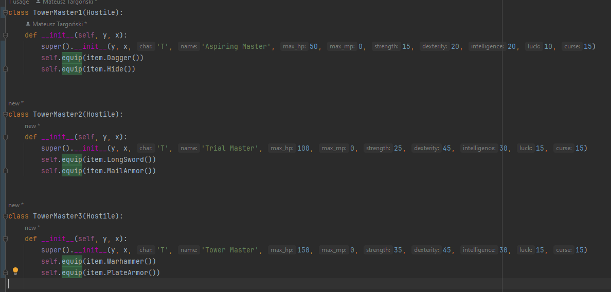
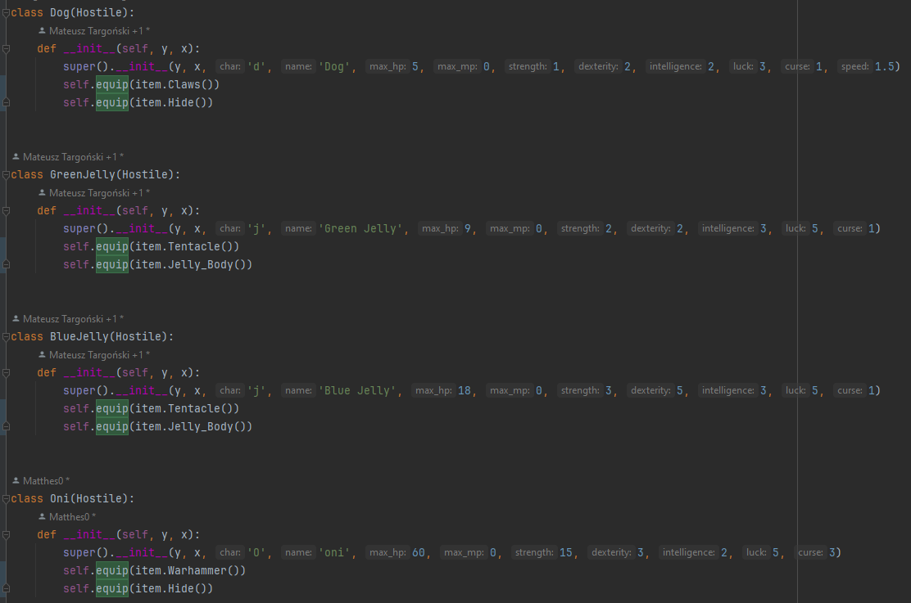
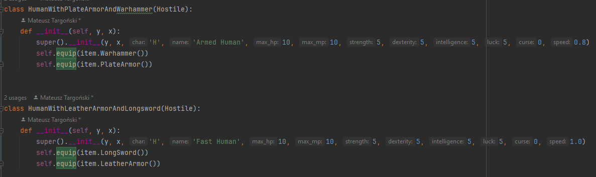

# Tower of God - roguelike game

# Ogólny zarys fabularny

Gra jest oczywiście klasycznym roguelikiem. Cel gry polega na wejściu na szczyt tytułowej wieży, co pozwoli spełnić dowolne życzenie postaci gracza. Nie można zrobić jednak tego na samym początku gry, ponieważ aby do niej wejść należy zebrać klucze z 2 innych wież.
# Start gry

Gracz na starcie wybiera jedną z 3 ras dla swojej postaci: Człowiek, Wraithraiser lub Rashang.

Postać zaczyna bez ekwipunku w lokacji startowej (z wyjątkiem Rashanga, który zaczyna ze startowymi zaklęciami).

Na południu są sklepy, w których można kupić przedmioty za startową walutę. Na północy jest Wieża Boga odgrodzona 2 bramami, do otwarcia których potrzebne są klucze z innych wież. Na zachodzie znajduje się Wieża Początku, a na wschodzie Wieża Prób. Zalecane jest najpierw przejście Wieży Początku, aczkolwiek gracz może ukończyć je w dowolnej kolejności.
# Rasy
Rasa określa dodatkowe umiejętności gracza oraz startową walutę (Punkty Wieży). Im rasa ma lepsze bonusy startowe, tym mniej waluty na wyposażenie dostanie na start gry.
W grze występują 3 rasy:
- Human - sporo złota, przeciętne statystyki. Cechuje się wysokim potencjałem na dokonywanie wielkich czynów - podczas lvl-upa otrzymuje o 2 atrybuty do rozdania więcej.
- Wraithraiser (rasa wyglądająca jak duży człekokształtny krokodyl o brunatnym kolorze skóry) - o wiele lepsze statystyki, możliwość użycia heroizmu - boost do siły na kilka tur.
- Rashang (ludzko wyglądająca rasa o znamieniach na twarzy wyglądających inaczej u każdej osoby) - mało złota, zaczyna grę z 3 zaklęciami - heal, spark i 

# Poruszanie się, czas

Poruszanie w 8 kierunkach na touchpadzie. Każdy kierunek zajmuje tyle samo czasu.

Każdy aktor ma jakąś prędkość. Domyślnie będzie to 1.0. Jeśli aktor ma np. prędkość 1.1, to oznacza to, że co 10 tur wykona jedną dodatkową akcję nie liczącą się jako oddzielna tura.

# Skróty klawiszowe

- numpad (poruszanie się atakowanie, interakcja z otoczeniem. Numpad 8 i 2 służą również do przewijania różnych menu takich jak ekwipunek/przedmioty na podłodze/chat log/lista zaklęć. Ewentualnie można poruszać się strzałkami tracąc możliwość poruszania się na ukos)
- i (otworzenie ekwipunku)
- enter (ominięcie )

# Walka

Podział na walkę wręcz, walkę dystansową i magię.

Cechy liczące się w walce:
- zdrowie
- broń 
- pancerz 
- siła 
- zręczność
- klątwa 

Przebieg walki:
- trafienie: szansa na trafienie broni + zręczność atakującego + klątwa atakującego - szansa na unik broniącego - zręczność broniącego + klątwa broniącego. Szansa na trafienie zawsze wynosi co najmniej 5 (5% szans)
rzut kością d100, sukces to liczba mniejsza lub równa "rzut na trafienie"

jeśli rzut się udał, to następuje losowanie od 0.50 do 1.50. Zadane obrażenia to floor((obrażenia broni) * losowanie) + siła atakującego + klątwa atakującego - redukcja obrażeń broniącego. Zadane obrażenia zawsze wynoszą co najmniej 1. Jeśli zdrowie po otrzymaniu ataku będzie mniejsze lub równe 0, to broniący umiera.

##### Walka wręcz

Atakowanie przeciwników poprzez "wchodzenie" w przeciwnika. 

- Longsword, umiarkowana celność i obrażenia
- Dagger, wysoka celność, niskie obrażenia
- ataki bez użycia broni, zerowa celność i zerowe obrażenia, raczej niezalecane jest walczenie w taki sposób
- Warhammer, niska celność, wysokie obrażenia
- Longbow, umiarkowana celność i obrażenia
- Explosive Crystal, przy atakowaniu wręcz statystyki ataku praktycznie jak bez użycia broni
##### Walka dystansowa
Atakowanie poprzez celowanie na pole. Ataki bronią dystansową zużywają manę podobnie jak zaklęcia.

- Heal (uleczenie siebie x2 int za 10 many)
- Smite (zadanie x1 int obrażeń celowi za 5 many)
- Drain life (zadanie x1 int obrażeń celowi i uleczenie castera podłoga(1/2 int) za 15 many)
- Shoot (atak bronią za 2 many, wymaga założonego długiego łuku)
- Explosive Crystal (x2 int obrażeń za 25 many. Wymaga założonego kryształu)
- Heroism (10 siły na 5 tur za 10 many)
- Shatter (stałe zniszczenie niszczalnej ściany za 20 many)

# Statystyki, rozwój postaci
- zdrowie - punkty życia, zależne od siły
- zasób magiczny - rzucanie zaklęć, zależny od inteligencji

rozwijane statystyki przy lvl-upie:
- siła - obrażenia wręcz i zdrowie
- zręczność - szansa na unik i trafienie
- inteligencja - ilość zasobu magicznego (do zaklęć i walki dystansowej), siła zaklęć
- szczęście - większa szansa na wygenerowanie lepszych przedmiotów podczas generowania mapy (efekt dopiero na kolejnym piętrze jeśli chodzi o generowanie mapy)
- klątwa - dosyć unikatowy atrybut, bo w pewnym sensie osłabia bohatera. zwiększa szansę na otrzymanie obrażeń, ale za to zwiększa potencjał ofensywny bohatera (w pewnym sensie statystyka ta jest pod tzw. glass cannon buildy).

Co level up wzrasta zdrowie i otrzymuje się 3 punkty statystyk do rozdysponowania pomiędzy 5 dostępnych statystyk.

# Lokacje
Zdecydowana większość gry dzieje się w wieżach. Każda wieża będzie różniła się designem, przeciwnikami i poziomami trudności. Na początku dostępny jest tylko pierwsza wieża. Aby wejść do trzeciej wieży trzeba zebrać 2 fragmenty z poprzednich wież. 
W grze bohater pnie się w górę wieży. Można cofać się na poprzednie piętra, ale nie można wyjść z wieży przed jej ukończeniem. Warunkiem skończenia wieży jest pokonanie przeciwnika na jej szczycie.
# ekwipunek
body armour, hełm, płaszcz, pierścienie (2), naszyjnik, buty, broń

# przedmioty użytkowe (jednorazowe)
- kamienie runiczne - nauka zaklęć. Każdy kamień runiczny może pojawić się tylko raz. Od początku wiadomo, jakiego zaklęcia uczy dany kamień runiczny.
- mikstury - efekty pozytywne lub negatywne, można ich użyć bez identyfikacji, po napiciu się mikstury jest ona zidentyfikowana do końca aktualnego podejścia. Przykładowe efekty to uleczenie, trucizna (na pijącym), buff do obrażeń na kilkanaście tur. Ich efekt działania nie skaluje się od statystyk, zawsze działają tak samo.
- zwoje - mechanicznie działają podobnie do mikstur. Efekty to np. identyfikacja przedmiotu, ulepszenie przedmiotu, teleportacja. Ich efekt działania nie skaluje się od statystyk, zawsze działają tak samo.
# przeciwnicy

Przeciwnicy mają te same statystyki co gracz. Jeśli jest humanoidem, to może również używać tych samych przedmiotów, co gracz. Jeśli przeciwnik jest wyposażony w jakieś przedmioty, to ma szansę na ich upuszczenie po śmierci. Przeciwnicy mogą respawnować się na mapie, ale tylko na obszarze jeszcze niezeksplorowanym przez gracza.

Przeciwnicy dodani na ten moment:

Human with leather armor and longsword
hp: 10
siła: 5
zręczność: 5
szczęście: 5
klątwa: 0
broń: Longsword
pancerz: Leather armor

Human with plate armor and warhammer
hp: 10
siła: 5
zręczność: 5
szczęście: 5
klątwa: 0
broń: Warhammer
pancerz: Plate armor

Dog 
hp: 5
siła: 1
zręczność: 2
szczęście: 3
klątwa: 1
broń: Claws
pancerz: Hide

Green Jelly
hp: 9 
siła: 2
zręczność: 3
szczęście: 5
klątwa: 1
broń: Tentacle
pancerz: Jelly body

Blue Jelly
hp: 18
siła: 3
zręczność: 5
szczęście: 5
klątwa: 1
broń: Tentacle
pancerz: Jelly body 

Oni 
hp: 60
siła: 15
zręczność: 3
szczęście: 5
klątwa: 3
broń: Warhammer 
pancerz: Hide

Tower Master
hp: 250
siła: 45
zręczność: 45
szczęście: 15
klątwa: 15
broń: Warhammer
pancerz: Hide

# Inspiracja
Sam zarys fabularny jest nawiązaniem do południowokoreańskiego komiksu Tower of God, którego fabuła w skrócie opiera się o wspinanie się na tajemnicze wieże, po wejściu na które można spełnić swoje dowolne życzenie.

